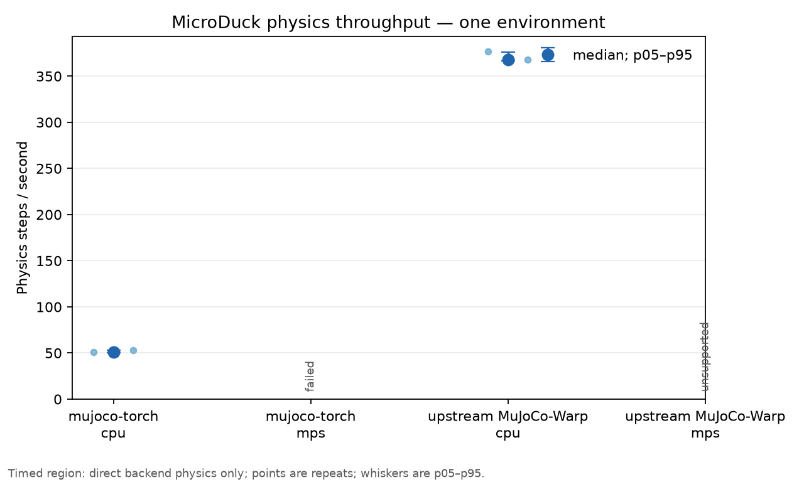

# MicroDuck RL Torch: Train MicroDuck Without an NVIDIA GPU

<p align="center">
  A PyTorch-native reinforcement-learning stack for <a href="https://www.pollen-robotics.com/">Pollen Robotics</a>' MicroDuck:
  prototype locally on macOS, then scale the same workflow to NVIDIA GPUs or the cloud.
</p>

<p align="center">
  <a href="https://github.com/bsprenger/microduck-rl-torch/actions/workflows/ci.yml"></a>
  <a href="https://app.codecov.io/gh/bsprenger/microduck-rl-torch"></a>
  
  
</p>

<p align="center">
  <strong>Prototype on your Mac. Scale on CUDA. Keep the workflow.</strong><br>
  <em>🎬 MicroDuck walking demo coming soon</em>
</p>

## The problem: MicroDuck RL is CUDA-first

The official MicroDuck reinforcement-learning stack is built on
[`mjlab`](https://github.com/mujocolab/mjlab), which uses
[MuJoCo Warp](https://mujoco.readthedocs.io/en/latest/mjwarp/index.html) (`mjwarp`) for
GPU-accelerated physics. That is a powerful stack—but its practical training path is built for
NVIDIA CUDA.

If you have a MacBook, Mac Studio, or a machine without an NVIDIA GPU, CUDA is not an optional
speedup. It is the missing prerequisite. You cannot simply clone the upstream project and train
your MicroDuck locally using its intended workflow. You must move to an NVIDIA machine or rent
one in the cloud first.

MJX is not a straightforward solution either. MJX is a JAX implementation of MuJoCo physics,
so a PyTorch policy and trainer must interoperate with a separate JAX/XLA runtime. Even when the
JAX backend can run on a Mac, it is a poor drop-in replacement for the CUDA-first MicroDuck
training path: the backend, performance, tensor types, compilation tools, and debugging workflow
are all different.

**Most MicroDuck users should not need to buy or rent an NVIDIA GPU just to start experimenting.**

## The solution: MicroDuck physics in PyTorch

This project brings the canonical MicroDuck model and policy interface into a PyTorch-native
workflow. It uses [`mujoco-torch`](https://github.com/vmoens/mujoco-torch), a PyTorch
implementation of the MuJoCo/MJX physics path, so simulation state and training tensors can live
in the same framework.

That makes CPU-first development possible today, including on macOS, and provides a path to local
training at modest scale. The same PyTorch environment can then move to an NVIDIA GPU for long,
high-throughput runs—or to a cloud GPU without changing the task implementation. CUDA remains
available as an acceleration path when you have it—but it is no longer the admission ticket.

This is not a toy replacement robot or a new model format. The project uses the official
MicroDuck MuJoCo XML, meshes, actuator ordering, observation contract, and deployment policy so
that experiments remain connected to the real robot workflow.

## Prototype locally. Scale when ready.

The key idea is one environment and one workflow across hardware:

| Where you run | What it is for |
| --- | --- |
| **macOS + CPU** | Install easily, inspect the environment, debug parity, and prototype with `torch.compile` locally. |
| **macOS + Apple MPS** | Use the Apple GPU through PyTorch, including `torch.compile` for supported graph paths and operators. |
| **NVIDIA + CUDA** | Run the same environment and training code at large scale when you need maximum throughput. |
| **[Hugging Face Jobs](https://huggingface.co/docs/huggingface_hub/guides/jobs)** | Launch long cloud-GPU training runs with the same workflow used upstream; support is coming soon. |

This is the difference between a portable PyTorch environment and a CUDA-only simulator. You can
develop on the laptop in front of you, build confidence with the real MicroDuck model and task,
then scale the same code to a serious NVIDIA run. There is no separate Warp-only environment to
rewrite, and no JAX-to-PyTorch training pipeline to maintain.

The upstream project already uses Hugging Face Jobs to offload long training runs. This project
is designed to preserve that destination: prototype and validate locally, then submit the same
task and training workflow to a cloud GPU when you are ready. The launcher is coming soon.

The goal is not merely “supporting Mac.” It is preserving the same model, task contract, policy
interface, and training workflow everywhere—while letting each machine use the PyTorch device it
actually has.

## Why the PyTorch-native boundary matters

MuJoCo Warp does have a PyTorch interface, and `mjlab` can share GPU memory with PyTorch without
blindly copying every tensor. The important distinction is deeper: the physics still executes
inside Warp. Torch can consume the results, but TorchInductor cannot see inside `mjwarp.step` to
fuse its physics kernels with the policy, observations, rewards, or rollout logic.

With `mujoco-torch`, the physics is expressed as PyTorch operations. That creates a path toward a
single compiler-visible rollout graph:

```text
policy → action processing → physics → observations → rewards → next state
```

When shapes and control flow are made static, the whole rollout step can potentially participate
in `torch.compile`, `torch.vmap`, and PyTorch automatic differentiation. In other words, the
goal is not merely to pass tensors between PyTorch and a simulator. The goal is to let PyTorch
own the simulation/training path end to end.

That opens the door to:

- **Training without an NVIDIA GPU:** run the development and small-scale training workflow on
  CPU or Apple MPS, including macOS.
- **One framework:** use PyTorch tensors, compilation, device placement, profiling, and
  debugging across the policy and physics.
- **A single graph boundary:** compile physics, observations, rewards, and policy execution
  together instead of handing physics to an opaque external runtime.
- **Differentiable simulation:** differentiate simulated behavior with respect to actions,
  controls, or model parameters for system identification, trajectory optimization, and
  model-based control.
- **MuJoCo compatibility:** retain the model format and reference simulator used by the official
  MicroDuck assets and deployment workflow.

The distinction is simple:

| | Upstream `mjwarp` / `mjlab` | MicroDuck RL Torch |
| --- | --- | --- |
| Physics runtime | NVIDIA Warp kernels | PyTorch operations through `mujoco-torch` |
| Practical training path | NVIDIA CUDA GPU | CPU/MPS locally; CUDA or cloud GPU when scaling |
| PyTorch integration | Zero-copy bridge to a separate physics runtime | Native tensors throughout the physics path |
| Compiler visibility | Torch sees the boundary, not the Warp kernels | Physics can participate in a PyTorch graph |
| Graph mechanism | Warp/CUDA graph capture | Potential `torch.compile` graph across the rollout |

`mjwarp` can absolutely capture and replay its own CUDA graph. The advantage here is different:
**PyTorch can potentially compile across the physics boundary because the physics is PyTorch code.**

## What this repository provides today

The current repository establishes the trustworthy MicroDuck simulation and policy boundary
needed for the portable training stack:

- the official MuJoCo XML, meshes, keyframes, and actuator ordering;
- the `new_cmd_obs` 61-element observation contract;
- the official 14-output ONNX deployment policy;
- the 50 Hz policy loop, 0.005 s physics timestep, and four-step decimation;
- native MuJoCo versus `mujoco-torch` rollout comparisons with a tracked BAM golden trace; and
- reproducible policy provenance with a resolved Hugging Face revision and SHA-256 digest.

The full upstream trainer is not claimed yet. The current milestone is the policy-facing task:
the public ONNX deployment policy, BAM M6 control path, 61D observations, reset randomization,
reward terms, and native golden trajectory are implemented without reconstructing a private
training checkpoint. TorchRL trainer/checkpoint parity remains a separate layer.

The intended destination is a single PyTorch workflow that can be prototyped on CPU or Apple MPS,
compiled locally where supported, and then run unchanged for long CUDA or Hugging Face Jobs
training runs. The training entry point and Hugging Face Jobs launcher are coming soon; the
environment and parity foundation are being built first so those runs start from a trustworthy
contract.

The repository also includes a direct upstream-Warp parity runner. It launches the actual
`mjlab_microduck` velocity task in a separately provisioned upstream Python environment, then
compares the same HF policy rollout against the local Torch task at control steps
`1, 5, 10, 25, 50, 100, 250, 500`. This is distinct from the native MuJoCo diagnostic: it is the
reference check for the Warp-based environment used by upstream training.

## Installation

Install [Python 3.12](https://www.python.org/) and
[`uv`](https://docs.astral.sh/uv/). The development configuration currently uses a local
`mujoco-torch` checkout; make sure the direct dependency in `pyproject.toml` resolves to that
checkout for your machine.

From the repository root, synchronize the environment and development tools:

```bash
make install
```

The upstream Warp reference dependencies are intentionally optional. Install them when running
the true upstream parity check:

```bash
make install-upstream
```

The benchmark plotting dependency is also optional:

```bash
make install-benchmark
```

The default install is equivalent to:

```bash
uv sync --group dev --group training
```

After changing the sibling simulator checkout, rebuild the installed local wheel with:

```bash
uv sync --reinstall-package mujoco-torch --group dev --group training
```

The optional `training` dependency group includes [TorchRL](https://pytorch.org/rl/) for the
training layer as it is added.

## Quick start

Download the official deployment policy, validate its dimensions and provenance, then run a
short native MuJoCo versus `mujoco-torch` rollout:

```bash
make verify-quick
```

The policy and manifest are written to `artifacts/hf/`, which is intentionally ignored by Git.
The default validation is a bounded CPU smoke test with contacts disabled so the high-detail mesh
scene can initialize predictably. To attempt the full contact path:

```bash
CONTACTS=enabled make validate-env
```

Render the golden policy in the Torch environment and write both a full-CAD video and a looping GIF:

```bash
make render-golden-gif
```

This writes `artifacts/render/microduck-alpha-walking.mp4` and
`artifacts/render/microduck-alpha-walking.gif`. The rollout dynamics and observations come from
`mujoco-torch`; the default renderer uses native MuJoCo only to rasterize that Torch state with
the complete CAD visual model. `make render-golden-torch` runs the same Torch environment and
writes `-torch.mp4`/`-torch.gif` outputs.

The rollout duration can be selected directly from the Makefile. Ten simulated seconds at the
50 Hz policy rate are 500 control steps:

```bash
make render-golden-gif RENDER_SECONDS=10
# or use the convenience target:
make render-golden-10s
```

`RENDER_SECONDS` is converted using the model timestep and decimation, so it remains correct if
those values change. `RENDER_STEPS` remains available for exact step-count experiments.
Rendering defaults to contacts with the floor enabled and detailed mesh-to-mesh contacts disabled;
the latter can make a fallen CAD model spend an unbounded amount of time in the convex SAT solver.
Use `RENDER_MESH_MESH_CONTACTS=enabled` when that self-contact path is specifically under test.

To exercise the pure Torch ray renderer instead, run:

```bash
make render-golden-ray RENDER_WIDTH=64 RENDER_HEIGHT=48
```

The pure Torch renderer uses the attached head camera and is substantially more demanding for the
detailed CAD meshes; ray processing is chunked to avoid an all-pixels/all-triangles allocation.
The native renderer is launched through the macOS `mjpython` compatibility wrapper. `ffmpeg` must
be installed and available on `PATH` for either video or GIF output.

For a direct CPU physics smoke test:

```python
import torch

from microduck_rl_torch.envs import NominalMicroDuckEnv
from microduck_rl_torch.envs.model import load_microduck_model

bundle = load_microduck_model(device="cpu", disable_contacts=True)
env = NominalMicroDuckEnv(bundle)
observation = env.reset()
result = env.step(torch.zeros(bundle.action_size, dtype=bundle.dtype))

print(observation.shape)         # torch.Size([61])
print(result.observation.shape)  # torch.Size([61])
```

To validate a different policy from the official manifest, set `POLICY` to its filename stem:

```bash
POLICY=alpha_stand make validate-policy
```

To run the true upstream-Warp comparison, first install the optional reference group, then provide
the upstream checkout. The default interpreter is this repository's `.venv`:

```bash
make install-upstream
make warp-parity \
  UPSTREAM_ROOT=/path/to/microduck_rl \
```

The default run is 500 policy steps (10 seconds at 50 Hz) and writes
`artifacts/parity/microduck-warp-500.md` plus a JSON sidecar. The table reports cumulative maximum
absolute differences for policy actions, actor observations, post-step `qpos`, and post-step
`qvel`. The reference run is deliberately deterministic: one flat environment, fixed command,
zero actuator-delay randomization, no domain-randomization events, and no actor observation
corruption. This makes the report useful for diagnosing implementation differences. It does not
pretend that independently implemented contact solvers will be bit-identical; the thresholds are
explicit command-line options and the report preserves the exact upstream revision/configuration.

The command exits nonzero when the selected `--fail-on` threshold is exceeded. Use
`WARP_PARITY_FAIL_ON=none` for a diagnostic report while bringing a new backend up.

## Physics benchmark

The initial benchmark measures only steady-state physics stepping for one environment. It uses a
fixed zero-load direct-motor-control tape, float32 models, four solver iterations, 10 untimed
warmup steps, and three timed repeats. Policy inference, action processing, observations, rewards,
termination, rendering, logging, reset, and host-side state copies are outside the timed region.
The headline is the median physics steps per second; the graph also shows every repeat and the
p05–p95 range. Increase `BENCHMARK_STEPS` and `BENCHMARK_REPEATS` for a less exploratory run on
faster hosts; the MPS path on this host is unusually slow for the contact-heavy model.

Run the local `mujoco-torch` and upstream MuJoCo-Warp backends on every requested device with:

```bash
make benchmark-physics UPSTREAM_ROOT=/path/to/microduck_rl
```

The default local benchmark disables detailed mesh-mesh contacts to measure the stable rollout
path. Use `BENCHMARK_MESH_MESH_CONTACTS=enabled` to include the local convex-SAT path; the
upstream Warp benchmark always uses the collision masks from its robot model, including the
self-collision mesh geoms.

This writes machine-readable results to `artifacts/benchmarks/physics-single-env/` and refreshes
the graph below. On a host without Apple MPS, the MPS cells are recorded as unsupported rather
than silently falling back to CPU. MuJoCo-Warp currently has no MPS backend, so a future
cross-platform dashboard should compare MPS against a Torch backend and keep Warp in the CPU /
CUDA columns.



The graph's x-axis identifies backend and device; its y-axis is direct physics steps per second.
This is deliberately separate from a future policy benchmark: ONNX Runtime currently executes
the official policy on CPU, so including it would measure device-transfer and policy-runtime
choices rather than physics throughput.

## Development

The `Makefile` collects repeatable commands for setup, checks, tests, artifact validation, and
packaging:

```bash
make check                         # lint, type checking, dependency hygiene
make test                          # unit and integration tests
make coverage                      # test suite with coverage reporting
make reinstall-mujoco-torch        # rebuild the local sibling simulator dependency
make validate-policy               # inspect the official ONNX policy and manifest
make validate-env STEPS=8          # short policy-driven environment rollout
make verify-quick                  # policy validation plus environment validation
make warp-parity                   # 500-step local Torch vs upstream Warp table
make benchmark-physics              # single-environment physics throughput graph + JSON/CSV
make render-golden                 # golden Torch rollout to MP4
make render-golden-gif             # golden Torch rollout to MP4 and GIF
make render-golden-torch           # full-CAD Torch rollout to MP4 and GIF
make render-golden-ray             # pure mujoco-torch ray-rendered rollout
make render-golden-10s              # 10-second golden rollout to MP4 and GIF
make generate-golden-trajectory     # regenerate the native BAM parity fixture
make build                         # build a wheel and source distribution
```

## Layout

```text
assets/robot/microduck/       Pinned MuJoCo XML and robot meshes
src/microduck_rl_torch/       Environment, model, observation, and policy code
src/microduck_rl_torch_verification/
                              Native, Torch, and upstream-Warp validation harness
scripts/                      Reproducible command-line entry points
tests/                        Contract and short-rollout tests
docs/                         Policy parity and artifact notes
```

## Credits and licensing

The robot model and simulation assets are derived from
[`pollen-robotics/microduck_rl`](https://github.com/pollen-robotics/microduck_rl). See
[`THIRD_PARTY_NOTICES.md`](THIRD_PARTY_NOTICES.md) for asset attribution and redistribution terms.
Project code is released under the [Apache-2.0 license](LICENSE).
