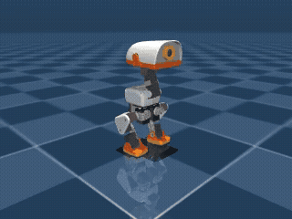

# microduck-rl-torch: A portable Microduck simulation and training stack

<p align="center">
  <a href="https://github.com/bsprenger/microduck-rl-torch/actions/workflows/ci.yml"></a>
  <a href="https://app.codecov.io/gh/bsprenger/microduck-rl-torch"></a>
  
  
</p>

<p align="center">
  <strong>🦆 Train your Microduck on any compute target, from Apple Silicon to H100 clusters, powered by PyTorch-native physics. ⚡</strong>
</p>

<p align="center">
  
</p>

## TL;DR

This repository ports `microduck_rl`’s Microduck simulation and training environment to PyTorch,
**with accelerated physics simulation powered by [`mujoco-torch`](https://github.com/vmoens/mujoco-torch)**.

**CUDA welcome. Not required.** `microduck-rl-torch` enables you to run the **same environment** on Apple MPS,
AMD ROCm, **or** CUDA! (unlike the official [`microduck_rl`](https://github.com/pollen-robotics/microduck_rl), which only supports CUDA 😔)

* **Prototype training loops anywhere.** Run GPU-accelerated training on your MacBook Pro with MPS,
  use CPU for CI and reproducibility, continue on an AMD ROCm workstation, or scale to multi-GPU H100 training.
* **Scale without rewriting.** Change your compute target, not your simulation environment.
  **Same parallelizable physics simulation. Any accelerator!**

Bonus: your physics and training code live in the same PyTorch graph. Fuse the entire step into optimized GPU kernels,
and let gradients flow through your simulation environment!

## The PyTorch-native physics layer

`mujoco-torch` is the workhorse that powers all this flexibility: a PyTorch-native reimplementation
of the MuJoCo/MJX physics pipeline.

It turns simulation state, dynamics, contacts, sensors, and rollouts into native PyTorch tensor
operations that can participate in the same compute stack as your policy and training code:

- **Device portability:** CPU, Apple MPS, AMD ROCm, NVIDIA CUDA, and other PyTorch-compatible accelerators.
- **Massive batching:** `torch.vmap` across many environments.
- **Compiled execution:** `torch.compile` for optimized simulation steps.
- **Differentiable workflows:** autograd through simulation when useful.
- **One ecosystem:** shared device placement, debugging, profiling, and training tools.

🚀 **Clone it, choose your accelerator, and start experimenting with Microduck inside the PyTorch ecosystem!**

## Installation

> [!NOTE]
> This repository currently depends on a specific Git commit of `mujoco-torch` because the latest
> upstream release does not yet include all of the fixes required by the Microduck environment.
> The dependency is pinned to
> [`02456ded`](https://github.com/bsprenger/mujoco-torch/commit/02456ded21c15e21cec5ebab99872ef9676afbd1)
> from the `ben-microduck-fixes` branch while the necessary fixes are being upstreamed.

### Using uv

Install [Python 3.12](https://www.python.org/) and [`uv`](https://docs.astral.sh/uv/), then clone
the repository and run:

```bash
git clone https://github.com/bsprenger/microduck-rl-torch.git
cd microduck-rl-torch
make install
```

`make install` uses uv to create or synchronize the development environment and install the dev and
training dependency groups. From an existing checkout, run the underlying command directly:

```bash
uv sync --group dev --group training
```

To reinstall the locked `mujoco-torch` dependency:

```bash
uv sync --reinstall-package mujoco-torch --group dev --group training
```

The optional `training` group installs TorchRL.

## Quick start

Install the project, then run the official `alpha_walking` policy in a live MuJoCo viewer:

```bash
PYTHONPATH=src uv run python scripts/run_with_mjpython.py scripts/live_policy_viewer.py
```

The viewer advances physics in the `mujoco-torch` environment and mirrors each state into the
native MuJoCo viewer. The script automatically uses CUDA, then Apple MPS, then CPU; override the
choice explicitly with:

```bash
MICRODUCK_DEVICE=mps PYTHONPATH=src uv run python \
  scripts/run_with_mjpython.py scripts/live_policy_viewer.py
```

## Development

The development workflow is for contributors and maintainers working from a source checkout.

The `Makefile` collects repeatable commands for environment setup, code quality checks, tests,
policy validation, rendering, parity checks, and package builds. Run
`make help` to see all available targets.

```bash
make check                         # formatting, linting, typing, dependency checks
make test                          # unit and integration suite
make coverage                      # test suite with coverage report
make verify-quick                  # fetch the policy and validate the environment
make render-golden-10s             # render the golden policy to MP4 and GIF
make warp-parity MICRODUCK_RL_ROOT=/path/to/microduck_rl
make build                         # build a wheel and source distribution
```

The [`policy parity guide`](docs/policy-parity.md) describes the deterministic native fixture and
optional `microduck_rl` MuJoCo-Warp comparison. [`Known limitations`](docs/known-limitations.md)
documents backend and task boundaries.

## License and attribution

Code is licensed under the [Apache License 2.0](LICENSE). The robot model and mesh files retain
the licenses and attribution requirements described in
[`THIRD_PARTY_NOTICES.md`](THIRD_PARTY_NOTICES.md).
